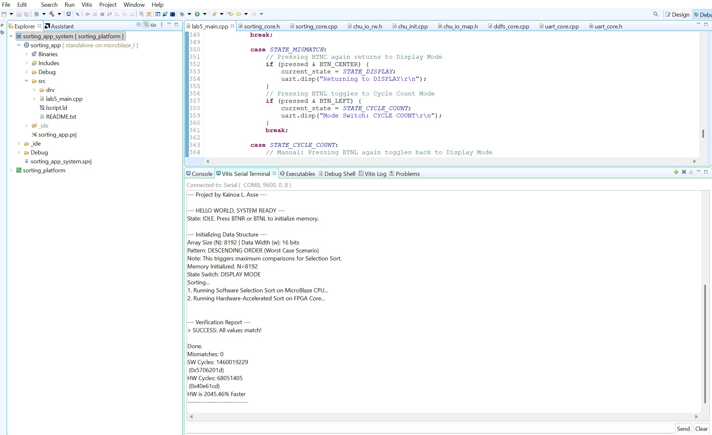

# FPGA Hardware-Accelerated Sorter
**Developed by: Kainoa L. Asse**

## Project Goal
This project compares a standard **Software Sort** (running on a MicroBlaze CPU) against a **Custom VHDL Hardware Accelerator**. The goal was to prove that dedicated FPGA logic can process data significantly faster than a general-purpose processor.

## How Selection Sort Works
Selection Sort is a comparison-based sorting algorithm that works by:
1. Dividing the input list into a sorted sublist and an unsorted sublist.
2. Scanning the unsorted sublist to find the minimum (or maximum) element.
3. Swapping that element with the leftmost unsorted element and moving the sublist boundary one step to the right.
4. Repeating this until the entire list is sorted.

## Why It Is "Slow" in Software
Selection Sort has a Time Complexity of $O(n^2)$. 
In a software environment, every single comparison and swap requires the CPU to:
1. Fetch and decode instructions.
2. Load data from memory into registers.
3. Perform the arithmetic/logic comparison.
4. Branch based on the result and store the data back.

As the dataset grows (e.g., to 8,192 elements), these billions of clock cycles result in a significant "bottleneck" where the processor is stuck performing repetitive operations sequentially.

## Performance Results (The "Worst Case" Benchmark)
I tested the system using 8,192 elements initialized in **Descending Order** (the hardest scenario for a selection sort).

| Metric | Software (CPU) | Hardware (FPGA) |
| :--- | :--- | :--- |
| **Clock Cycles** | 1,460,019,229 | 68,051,405 |
| **Execution Time** | ~14.6 seconds | ~0.68 seconds |

**Result:** The Hardware Accelerator achieved a **21.4x Speedup** (over 2000% faster).

## Verification Screenshot
Below is the output from the Vitis Serial Terminal confirming the cycle counts and data accuracy:

## How It Works
* **Hardware:** Basys 3 FPGA (Artix-7).
* **Communication:** Used MMIO (Memory-Mapped I/O) to send data from the processor to the FPGA RAM.
* **Accuracy:** The system compares the results of both sorts to ensure 0 mismatches.
